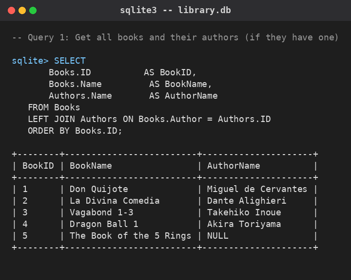
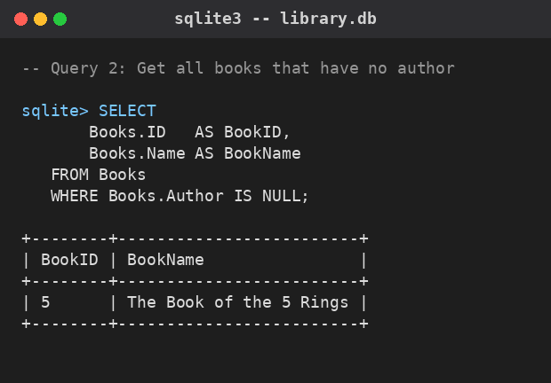
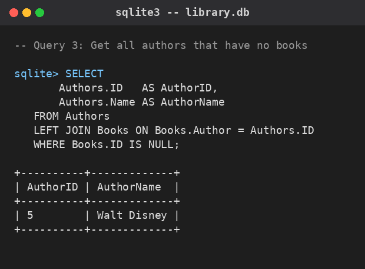
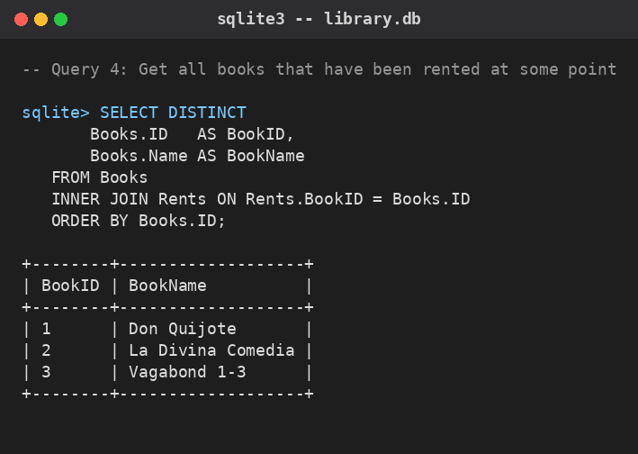
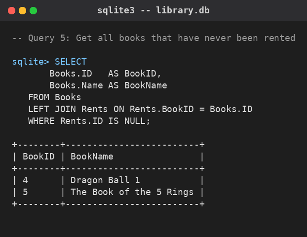
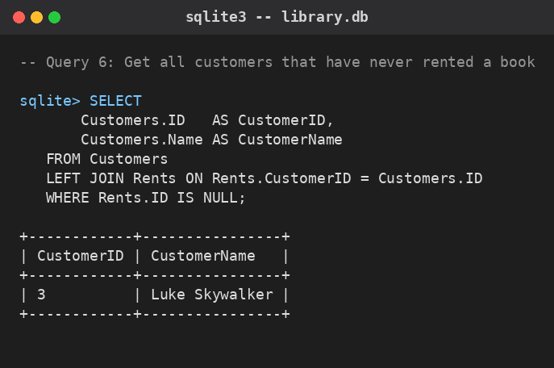
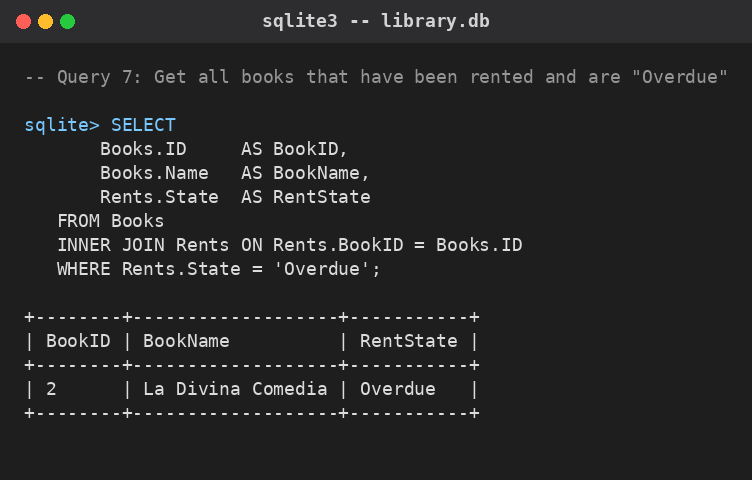

# SQL Exercise: Books / Authors / Customers / Rents

Database engine used: **SQLite** (file `library.db` in this folder, built
from `schema.sql` + `seed_data.sql`). All queries below were executed
against that database; each result is shown as a query + a screenshot of
its actual output.

## Tables

**Books**

| ID | Name | Author |
|----|------|--------|
| 1 | Don Quijote | 1 |
| 2 | La Divina Comedia | 2 |
| 3 | Vagabond 1-3 | 3 |
| 4 | Dragon Ball 1 | 4 |
| 5 | The Book of the 5 Rings | NULL |

**Authors**

| ID | Name |
|----|------|
| 1 | Miguel de Cervantes |
| 2 | Dante Alighieri |
| 3 | Takehiko Inoue |
| 4 | Akira Toriyama |
| 5 | Walt Disney |

**Customers**

| ID | Name | Email |
|----|------|-------|
| 1 | John Doe | j.doe@email.com |
| 2 | Jane Doe | jane@doe.com |
| 3 | Luke Skywalker | darth.son@email.com |

**Rents**

| ID | BookID | CustomerID | State |
|----|--------|------------|-------|
| 1 | 1 | 2 | Returned |
| 2 | 2 | 2 | Returned |
| 3 | 1 | 1 | On time |
| 4 | 3 | 1 | On time |
| 5 | 2 | 2 | Overdue |

---

## Query 1: Get all books and their authors (if they have one)

Uses a `LEFT JOIN` from `Books` to `Authors` so that every book is kept
even if it has no matching author (the book keeps `NULL` in the
`AuthorName` column instead of being dropped).

```sql
SELECT
    Books.ID          AS BookID,
    Books.Name         AS BookName,
    Authors.Name       AS AuthorName
FROM Books
LEFT JOIN Authors ON Books.Author = Authors.ID
ORDER BY Books.ID;
```



---

## Query 2: Get all books that have no author

Filters `Books` directly for rows where the `Author` foreign key is
`NULL` — no join needed.

```sql
SELECT
    Books.ID   AS BookID,
    Books.Name AS BookName
FROM Books
WHERE Books.Author IS NULL;
```



---

## Query 3: Get all authors that have no books

`LEFT JOIN`s `Authors` to `Books`, then keeps only the rows where the
join found no matching book (`Books.ID IS NULL`). This is the classic
"anti-join" pattern.

```sql
SELECT
    Authors.ID   AS AuthorID,
    Authors.Name AS AuthorName
FROM Authors
LEFT JOIN Books ON Books.Author = Authors.ID
WHERE Books.ID IS NULL;
```



---

## Query 4: Get all books that have been rented at some point

Uses an `INNER JOIN` between `Books` and `Rents`, so only books that
appear at least once in `Rents` are returned. `DISTINCT` avoids
repeating a book that was rented more than once.

```sql
SELECT DISTINCT
    Books.ID   AS BookID,
    Books.Name AS BookName
FROM Books
INNER JOIN Rents ON Rents.BookID = Books.ID
ORDER BY Books.ID;
```



---

## Query 5: Get all books that have never been rented

`LEFT JOIN`s `Books` to `Rents` and keeps only the rows with no matching
rent record — the same anti-join pattern used in Query 3.

```sql
SELECT
    Books.ID   AS BookID,
    Books.Name AS BookName
FROM Books
LEFT JOIN Rents ON Rents.BookID = Books.ID
WHERE Rents.ID IS NULL;
```



---

## Query 6: Get all customers that have never rented a book

Same anti-join pattern, this time from `Customers` to `Rents`.

```sql
SELECT
    Customers.ID   AS CustomerID,
    Customers.Name AS CustomerName
FROM Customers
LEFT JOIN Rents ON Rents.CustomerID = Customers.ID
WHERE Rents.ID IS NULL;
```



---

## Query 7: Get all books that have been rented and are "Overdue"

`INNER JOIN`s `Books` with `Rents` and filters on `State = 'Overdue'`.

```sql
SELECT
    Books.ID     AS BookID,
    Books.Name   AS BookName,
    Rents.State  AS RentState
FROM Books
INNER JOIN Rents ON Rents.BookID = Books.ID
WHERE Rents.State = 'Overdue';
```


